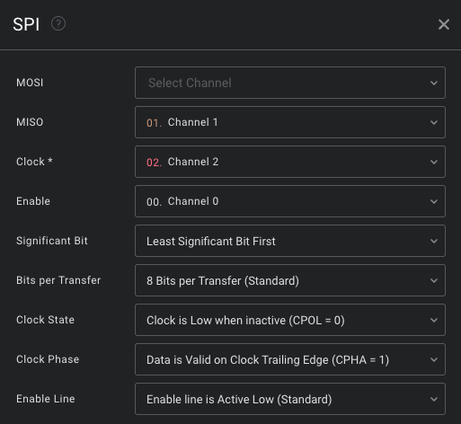

# Reverse-Engineering of Veyhl SKQ standing desk

This repository includes logic-analyzer-sessions as well as exported data and exploratory code that shows the progress of reverse-engineering the data-communication of my standing-desk.

## Why am I even doing this?

My goal is to perform a man-in-the-middle-attack on the data-communication and adjust the transmitted data, so that

- I don't have to keep pressing the button for a preset, until the desk is in the correct position
  - ⚠️ This functionality is a safety-feature called a deadman-switch and is a regularity enforced by law in some countries. Removing safety features almost always is a dumb idea.
- The correct height is displayed on the display
  - It's not centimeters, it's not inches, but rather 2.14 cm / 0.84 in per unit of measurement
- Add remote capabilities / integration into HomeAssistant

## Hardware / Software

- Target: Veyhl SKQ standing desk
- Logic Analyzer: Saleae Logic Pro 8
- Logic Analyzer Software: Saleae Logic 2

## Reverse Engineering Results

- Serial Protocol: 3 Wire SPI (Also called Bidirectional SPI or Half-Duplex SPI)

### SPI Settings

### Wiring

| Color  | Function    |
| ------ | ----------- |
| Black  | Chip Enable |
| Brown  | MOSI/MISO   |
| Red    | Clock       |
| Orange | 5V          |
| Yellow | 5V          |
| Green  | GND         |
| Blue   | GND         |
| Violet | 5V          |

### Data Transfer

| Data                | Meaning                              | Misc                                                |
| ------------------- | ------------------------------------ | --------------------------------------------------- |
| First Byte 0xA5     | Data from Control Panel              |                                                     |
| First Byte 0x5A     | Data from Motor Controller           | 0xA5 is exactly the inverse of 0x5A                 |
| 0xA5 0xA1 0x00 0xFE | Control Panel idle                   |                                                     |
| 0xA5 0xA1 0x04 0xFA | Button 1 pressed                     |                                                     |
| 0xA5 0xA1 0x08 0xF6 | Button 2 pressed                     |                                                     |
| 0xA5 0xA1 0x10 0xEE | Button 3 pressed                     |                                                     |
| 0xA5 0xA1 0x02 0xFC | Button 4 pressed                     |                                                     |
| 0xA5 0xA1 0x20 0xDE | Button S pressed                     |                                                     |
| 0xA5 0xA1 0x40 0xBE | Button "UP" pressed                  |                                                     |
| 0xA5 0xA1 0x80 0x7E | Button "DOWN" pressed                |                                                     |
| 0x5A 0x10 0xXX 0xXX | Motor Controller reports desk height | 3rd byte: 10s, 4th byte: 1s. Ex: 0x90 0x80 -> 91    |
| 0x5A 0x10 0x10 0x10 | Motor Controller goes to sleep       | Does this mean that the motor-controller is master? |

### Miscellaneous

- Control Panel sends "button pressed" sequence cyclically until the button is released

## TODO

- Record longer trace and see if
  - [x] "desk stop behavior" can be detected
    - No
  - [x] "desk at low security-boundary behavior" can be detected
    - No
  - [x] Which other 0x5A-frames are there?
    - Found one more - controller goes to sleep
  - [x] Are there any patterns (binary or otherwise) in the button-frames?
    - Kind of. see [decoding.ipynb](decoding.ipynb)
- Implement passthrough with TinyGo